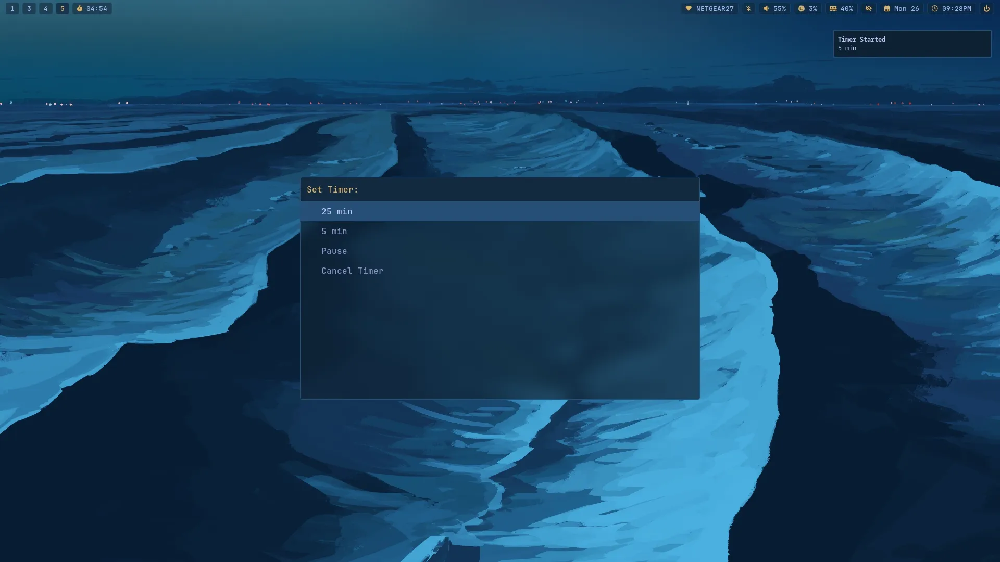
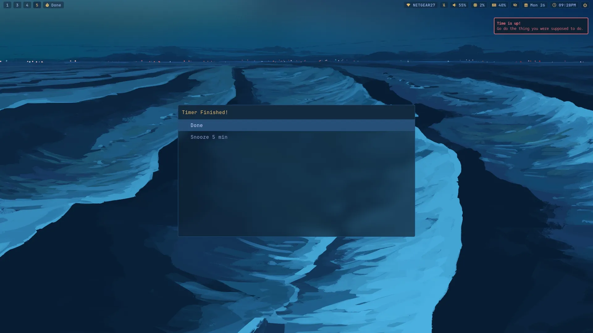

# Rofi Waybar Timer

A simple shell script that displays a countdown timer in the Waybar status bar, and uses Rofi for input.




Features:

- Allows user to set a custom timer with Rofi
- Displays a countdown timer in the Waybar status bar
- Popup menu to select from a list of options
- Pauses/resumes the timer when clicking the Waybar module
- Displays a popup and notification when the timer is finished (using Rofi lol)
- Easily snooze the timer for 5 minutes, or any custom time

## Installation

1. Put `rofi_waybar_timer.sh` in `~/.local/bin`
2. Add waybar module in `~/.config/waybar/config.jsonc`:

```json
  "custom/timer": {
    "exec": "~/.local/bin/rofi_waybar_timer.sh get",
    "on-click": "~/.local/bin/rofi_waybar_timer.sh toggle",
    "return-type": "json",
    "interval": 1,
    "format": "{icon}{text}",
    "format-icons": {
      "active": " ",
      "paused": "󰏤 ",
    },
  },
```

3. Style with CSS in `~/.config/waybar/style.css`
